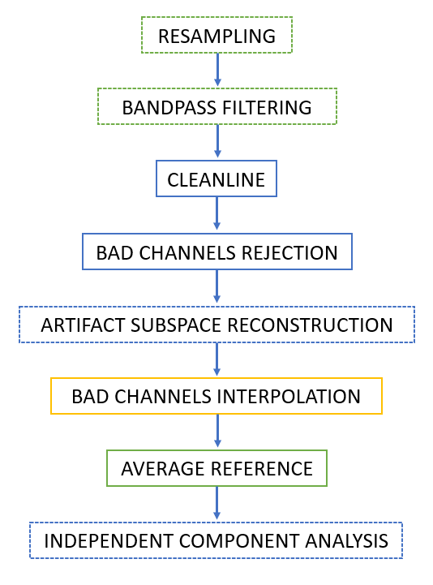
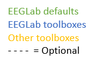

# RESTINGLAB

RESTINGLAB is an open-source [EEGLAB](https://github.com/sccn/eeglab)-based standalone software for automated/semi-automated Resting-State EEG data pre-processing and analyses.


*Currently the software is in beta version which means it may still contains errors.*\
*Contributions are thus more than welcome*.

**⚠️ OF NOTE: This software can currently only import [BioSemi](https://biosemi.com/) 64-channels EEG files.**

*Throughout the Guided User Interfaces (GUIs) you will find additional information while pressing on the* `❓ buttons`.


## Cite the repository
C.A. Wicht, RESTINGLAB, (2020), GitHub repository, https://github.com/CorentinWicht/RESTINGLAB \
[](https://zenodo.org/badge/latestdoi/227150916)

## Table of Contents

* [Getting Started](#getting-started)
  + [Structuring your files and folders](#structuring-your-files-and-folders)
  + [Guided User Interfaces](#guided-user-interfaces)
  + [1.Design](#1design)
    - [1.1.Participants Assignment](#11participants-assignment)
    - [1.2.Subjects](#12subjects)
  + [2.Parameters](#2parameters)
  + [3.Preprocessing](#3preprocessing)
    - [3.1.AreasList](#31areaslist)
  + [4.Analyses](#4analyses)
  + [Exports](#exports)
* [Preprocessing Pipeline](#preprocessing-pipeline)
* [Dependencies](#dependencies)
* [Authors](#authors)
* [License](#license)
* [Acknowledgements](#acknowledgements)
* [Fundings](#fundings)

<small><i><a href='http://ecotrust-canada.github.io/markdown-toc/'>Table of contents generated with markdown-toc</a></i></small>


## Getting Started

### Structuring your files and folders


The structure of your files and folder has to be done as following:

```
📁 [Group1]
 ↳ 📁 [Participant1] 
    ↳ 🧠 Condition1.bdf
    ↳ 🧠 Condition2.bdf
 ↳ 📁 [Participant2]
    ↳ 🧠 Condition1.bdf
    ↳ 🧠 Condition2.bdf
    
📁 [Group2]
 ↳ 📁 [Participant6] 
 ...
 
 📁 [OUTPUTS]
...
```

1) The first level of folders, e.g. ```Group1```, should be the **Between-subject factor levels**. If you don't have a between-subject factor, name it for e.g. ```Data```
2) The second level of folders, e.g. ```Participant1```, should correspond to the **participant number** (i.e. important to have the number at the end of the folder name!). 
3) File inside each ```Participant``` folders, should represent the **Within-subject factor levels** (e.g. ```Condition1.bdf```). 
4) Optionally, you can create an ```OUTPUTS``` folder in which you can decide to save the outputs of the analyses. 


### Guided User Interfaces

When on the [RESTINGLAB startup page](https://github.com/CorentinWicht/RESTINGLAB), start by clicking on `⬇️ Code` on the top right of the screen and then `Download ZIP` to download the whole repository (alternatively you can also clone it). 

To run the GUI, double click the **`MainGUI.mlapp`** file that you will find in the repository.

The main page of the GUI will open up:


**At this stage, all the buttons are `RED 🔘`, meaning that no parameters have been yet defined and the script cannot run.**


Hence, first, you should decide whether:
```
* You want to run the Preprocessing phase only, the Analysis phase only or both of them (bottom switch)
* You want to define new parameters or want to load existing ones (LOAD PARAMETERS button)
```

Then, you should proceed sequentially by following the sequence of buttons (see below for detailed explanations):
```
1.Design ➡️ 2.Parameters ➡️ 3.Preprocessing ➡️ 4.Analyses ➡️ START
```


### 1.Design

Start by defining your experimental design, i.e. within- and/or between-subjects factor(s) and respective levels in the corresponding fields.\
The software can accomodate up to 1 within- and 1 between-subjects factors each including 3 levels.\
**Be careful as NO SPACES are allowed in the names**.

**Within-subject factor (WS)**
**The names chosen for each WS factor level should perfectly match the common names of your files.**\
*For example, if your files contain the patterns "**_awake**.bdf" & "**_asleep**.bdf", you should define the levels correspondingly: "**awake**" & "**asleep**".*

**Between-subject factor (BS)**
**Similarly, for the BS factor you should name each level respectively to the folders in which you stored their files.**\
*For example, if you stored your EEG data separately in two folders `Experimental` & `Placebo`, you should define the levels correspondingly: "**Experimental**" & "**Placebo**".*


Once you are satisfied with your design, press the **`DIRECTORY`** button.\
A number of windows will pop-up in order for you to define the path of each BS factor level's folder.\
**!Have a look at the title of each pop-up window to know which level you need to indicate a path for!** 


Once done, you will see a last pop-up window asking you where you want to save **all the files that will be exported**.


#### 1.1.Participants Assignment 
Then, press the `ALLOCATION` button to start defining which file belongs to what WS and/or BS levels.\
In the top field you have the possibility to define the subjects' number that you want to include (each number should be separated by a space).\
**DO NOT leave any empty line in the table as the software may crash.**

You can also load existing parameters (`LOAD PARAMETERS` button, i.e. look for the `Conditions_order.xlsx` file).

When you are happy with your choice, press `SAVE`.\
By doing so, the `Conditions_order.xlsx` file will be generated in your exports folder.


#### 1.2.Subjects 
Now, you can press the `SUBJECTS` button which will allow you to select files to include and/or exclude.\ 
*Since this GUI is redundant with the previous the `ALLOCATION GUI`, it might be deleted in future releases.*\
Again, press the `SAVE` button when you are satisfied with your selection.


Finally, you can press the `SAVE` button when you are back to the `Design GUI` to switch to the next section.


### 2.Parameters

In the second GUI you have to define a few EEG data related parameters such as the extension (currently restricted to .bdf), sampling rate, channels, etc.\
**Importantly, in the top left field you should indicate a name that is common to all your files (e.g. "*Subj*").**\
This is important especially to avoid loading unrelated .bdf files that might be stored in your subfolders.\
*You can try to leave the field empty, but the software may crash*


Press the press the `SAVE` button to switch to the next section.


### 3.Preprocessing

The third GUI provides the user with the possibility to activate/deactivate specific algorithms (e.g. sleep detection (**currently not working**), ICA, ASR, etc.)\
Once you activate one of the algorithm (i.e. switch to `YES`), you can access their respective `Optional Parameters`below which are already filled with defaults.\
On the right side, you can activate the computation of Global Power Spectra and define which frequencies would you like to generate topographical plots (i.e. topoplots) for each file.\
If the `GPS swich` is on, you will be able to define the frequency bands of interest in the table below. Use the `ADD LINE` and `REMOVE LINE` button to adjust the table.


Finally, you can also define clusters of electrodes to compute the GPS (i.e. `2. GPS on Scalp Areas`), which will generate the following pop-up window:\
The first line enables to define the name of each cluster (separated by a space), while in each line you need to indicate the number or name of channels included in each cluster.


#### 3.1.AreasList


Press the press the `SAVE` button to switch to the next section.


### 4.Analyses

This last GUI enables you to run group and/or condition-wise statistical analyses.\
*This part is still under construction hence only few features are currently available.*

You have the possibility to redefine at this stage which files should be included in the analysis part by switching the `Subjects switch` to *Subset*.\
This will generate another GUI enabling you to include/exclude the files. 

On the right side, you can define whether to perform:
```
1.Frequency bands-level analyses (default is YES)
2. MicroStates analyses (default is NO)
3.Independent Components (IC) clustering and source localization (default is NO)
```
**⚠️ OF NOTE, the `MicroStates analysis` is running but needs additionnal testing and the `IC clustering analysis` is currently NOT WORKING.**

Both the MicroStates and the IC Clustering analyses have respective setting that can be accessed by clicking on the `Settings button`.


Press the press the `SAVE` button to go back to the main GUI.

As soon as all the buttons have turned to `GREEN 🔘`, you can run the script by clicking on the `START button`.


### Exports

The structure of the exportation folders will always be the same independent of your selection (i.e. some folders might remain empty):

```
📁 [Save Folder]
 ↳ 📁 [Group] 
    ↳ 🧠 design1_X_Group.datspec
    ↳ 🧠 FolderName_Condition_ExportSelection.fdt
    ↳ 🧠 FolderName_Condition_ExportSelection.set
    ↳ 🧠 FolderName_Condition_Preprocessed.bdf
 ↳ 📋 RESTINGLablog_DD_MM_YYYY-HH_MM.txt
 ↳ 📁 [Excel]
    ↳ 📁 [DD_MM_YYYY-HH_MM]
       ↳ 📋 Conditions_order.xlsx
       ↳ 📋 AreaAmplitudeFrequency.xlsx
       ↳ 📋 AsleepAwakeTrials.xlsx
       ↳ 📋 GPS_Frequency.xlsx
       ↳ 📋 InterpChannelsCondition.xlsx
       ↳ 📋 RejectedComponentsCondition.xlsx
 ↳ 📁 [Exports]
    ↳ 📁 [DD_MM_YYYY-HH_MM]
       ↳ 📁 [ICClust]
          ↳ 👷 UNDER CONSTRUCTION...
          ↳ 📁 [DomainX]
             ↳ 📊 SourceClustX_STUDY.bmp
             ↳ 📊 SourceClustX_STUDY.fig
             ↳ 📋 ICClustOutput_Domain4.txt
             ↳ 👷 UNDER CONSTRUCTION...
       ↳ 📁 [MicroStatesSegment]
          ↳ 📁 [VersionX]
             ↳ 📊 GFP_SX_condition_vX.bmp
             ↳ 💾 MicroStateRes_SX_condition_vX.mat
             ↳ 📁 [Fig]
                ↳ 📊 GFP_SX_condition_vX.fig
       ↳ 📁 [SleepNoSleep]
          ↳ 👷 UNDER CONSTRUCTION...
          ↳ 📊 WaveletMorletSleep_X_condition.bmp
       ↳ 📁 [SourceLocalisation]
          ↳ 📁 [Frequency]
             ↳ 💾 SX_Frequency_Group.ep
       ↳ 📁 [Topoplots]
          ↳ 📊 PowerSpectrumX_Group.bmp
       ↳ 📁 [TopoplotsDipFit]
          ↳ 📊 DipFitX_Group.bmp
          ↳ 📁 [LabelDipoles]
             ↳ 📊 LabelsFitX_Group.bmp
             ↳ 📊 LabelsFitBarX_Group.bmp
 ↳ 📁 [Parameters]
    ↳ 📁 [DD_MM_YYYY-HH_MM]
       ↳ 💾 AnalysesGUI.mat
       ↳ 💾 EEGParamGUI.mat
       ↳ 💾 GUIDesign.mat
       ↳ 💾 GUIPartList.mat
       ↳ 💾 GUIPreProcessing.mat
       ↳ 💾 GUISubjects.mat
       ↳ 💾 StudyGUI.mat
 ↳ 📁 [STUDY]
    ↳ 📁 [DD_MM_YYYY-HH_MM]
       ↳ 💾 SpectralData.mat
       ↳ 🧠 STUDY.study
       ↳ 🧠 STUDY_Clustered.study
       ↳ 📊 Boxplot_Frequency_STUDY_1.bmp
       ↳ 📊 ChanAVG_Group_STUDY.bmp
       ↳ 📊 Topoplots_STUDY_Frequency.bmp
       ↳ 📊 WholeSpect_STUDY.bmp
       ↳ 📁 [MicroStates]
          ↳ 📊 ClusterTopo_Group_STUDY_vX.bmp
          ↳ 📊 FitMeasures_OH_STUDY_vX.bmp
         
------------------------------------------------------------------         
Group            = Names of the levels of the BS factor
condition        = Names of the levels of the WS factor
FolderName       = Name of the subject folder
ExportSelection  = Name of the .set files you decided to save (see 2.Parameters)
Frequency        = Names that you gave to the frequency bands of interest
X                = Subject number X
vX / VersionX    = Version of analysis number X
SourceClustX     = Cluster of significant results number X
DomainX          = Brain spatial domain number X
DD_MM_YYYY-HH_MM = Date and time of analysis
📁 [Group]       = This folder will reproduce the structure of your 
                    data folders and will include the desired .set files 
------------------------------------------------------------------  
```
| FILES | Content |
| ------ | ------ |
| RESTINGLablog_DD_MM_YYYY-HH_MM.txt | Log generated for each run of the script containing a complete summary of all selected parameters and included files |
| Conditions_order.xlsx | List of subjects and condition/group assignment (WS and/or BS factors levels) |
| AreaAmplitudeFrequency.xlsx | List of subjects and associated maximum/minimum GPS values and cluster (optional, see [`AreasList`](#31areaslist)) |
| AsleepAwakeTrials.xlsx | List of subjects and associated number of Xseconds (user-defined in [GUI](#3preprocessing)) asleep and awake epochs |
| GPS_Frequency.xlsx | List of subjects and GPS values for each EEG channel (columns). There is one excel file for each frequency band of interest and inside each file there is one sheet for each WS factor level. |
| InterpChannelsCondition.xlsx | List of subjects and related channels label(number) that were automatically interpolated |
| RejectedComponentsCondition.xlsx | List of subjects and related independent components (ICs) that were semi-automatically rejected |
| ICClustOutput_Domain4.txt | Text file informing about anatomical information and voxels inside one cluster showing significant group and/or condition differences |
| MicroStateRes_SX_condition_vX.mat | Data matrix containing all the outputs generated from the main [MST](https://github.com/atpoulsen/Microstate-EEGlab-toolbox) functions |
| SX_Frequency_Group.ep | 1x64 matrix containing the time-averaged GPS for each of the 64 channels, for each frequency band of interest and condition. The .ep format can be opened in [STEN](https://zenodo.org/record/1167723#.Wuhxtn--ltQ) and [CARTOOL](https://sites.google.com/site/cartoolcommunity/), resp. to perform statistics and apply inverse source solutions |
| AnalysesGUI.mat | Data matrix generated by the [Preprocessing GUI](#3preprocessing) |
| EEGParamGUI.mat | Data matrix generated by the [Parameters GUI](#2parameters) |
| GUIDesign.mat | Data matrix generated by the [Design GUI](#1design) |
| GUIPartList.mat | Data matrix generated by the [Design GUI](#11participants-assignment) |
| GUIPreProcessing.mat | Data matrix generated by the [Preprocessing GUI](#3preprocessing) |
| GUISubjects.mat | Data matrix generated by the [Design GUI](#12subjects) |
| StudyGUI.mat | Data matrix generated by the [Analyses GUI](#4analyses) |
| SpectralData.mat | Data matrix containing the power spectra data following EEGLAB format, namely *lines = WS levels & columns = BS levels*. Inside each cell, the spectral data is formatted as follows: *frequency bins X channels X subjects* |
| STUDY.study | [EEGLAB STUDY structure](https://sccn.ucsd.edu/wiki/Chapter_07:_EEGLAB_Study_Data_Structures) for the group and/or condition-levels analyses |
| STUDY_Clustered.study | [EEGLAB STUDY structure](https://sccn.ucsd.edu/wiki/Chapter_07:_EEGLAB_Study_Data_Structures) for the IC clustering analysis |
| design1_X_Group.datspec | [Spectrum data for data channels](https://sccn.ucsd.edu/wiki/Chapter_07:_EEGLAB_Study_Data_Structures#STUDY_data_files) |
| FolderName_Condition_ExportSelection.fdt | Float data containing raw data |
| FolderName_Condition_ExportSelection.set | Meta-information (number of channels, sampling frequency etc...) |
| FolderName_Condition_Preprocessed.bdf | [BioSemi](https://biosemi.com/) EEG file generated after preprocessing and which can be easily open in [CARTOOL](https://sites.google.com/site/cartoolcommunity/) |


## Preprocessing Pipeline





**The pipeline structure was inspired from :** \
[Makoto's preprocessing pipeline](https://sccn.ucsd.edu/wiki/Makoto's_preprocessing_pipeline) \
<a id="1">[1]</a> 
Bidgely-Shamlo, N., Mullen, T., Kothe, C., Su, K.-M. & Robbins, K.A. (2015). 
[The PREP pipeline: standardized preprocessing for large-scale EEG analysis.
Frontiers in Neuroinformatics, 9, 1-20.](https://doi.org/10.3389/fninf.2015.00016)
<a id="1">[2]</a> 
Gabard-Durnam, L.J., Mendez Leal, A.S., Wilkinson, C.L. & Levin, A.R. (2018). 
[The Harvard Automated Processing Pipeline for Electroencephalography (HAPPE): Standardized Processing Software for Developmental and High-Artifact Data.
Frontiers in Neuroscience, 12, 1-24.](https://doi.org/10.3389/fnins.2018.00097)


**The choice of the EEGLAB toolboxes included in the pipeline where made according to:**
1) ```BLINKER```: \
<a id="1">[3]</a> 
Kleifges, K., Bidgely-Shamlo, N., Kerick, S.E. & Robbins, K.A. (2017). 
[BLINKER: Automated Extraction of Ocular Indices from EEG Enabling Large-Scale Analysis.
Frontiers in Neuroscience, 11, 1-17.](https://doi.org/10.3389/fnins.2017.00012) 
2) ```ASR```: \
<a id="1">[4]</a> 
Chang, C.-Y. Hsu, S.-H., Pion-Tonachini, L. & Jung, T.-P. (2018). 
[Evaluation of Artifact Subspace Reconstruction for Automatic EEG Artifact Removal.
Conf Proc IEEE Eng Med Biol Soc, 1242-1245.](https://doi.org/10.1109/EMBC.2018.8512547) \
<a id="1">[5]</a> 
Mullen, T.R., Kothe, C.A.E., Chi, Y.M., Ojeda, A., Kerth, T., Makeig, S., Jung, T.-P. & Cauwenberghs, G. (2015). 
[Real-Time Neuroimaging and Cognitive Monitoring Using Wearable Dry EEG.
IEEE Trans Biomed Eng, 62(11), 2553-2567.](https://doi.org/10.1109/TBME.2015.2481482)
3) ```ICLABEL```: \
<a id="1">[6]</a> 
Pion-Tonachini, L., Kreutz-Delgado, K. & Makeig, S. (2019). 
[ICLabel: An automated electroencephalographic independent component classifier, dataset, and website.
NeuroImage, 198, 181-197.](https://doi.org/10.1016/j.neuroimage.2019.05.026) 
4) ```AMICA```: \
<a id="1">[7]</a> 
Delorme, A., Parlmer, J., Onton, J., Oostenveld, R. & Makeig, S. (2012). 
[Independent EEG Sources Are Dipolar.
PLoS ONE, 7(2), e30135.](https://doi.org/10.1371/journal.pone.0030135) \
<a id="1">[8]</a> 
Parlmer, Makeig, S., Kreutz-Delgado, K. & Rao, B.D. (2008). 
[Newton method for the ICA mixture model.
2008 IEEE International Conference on Acoustics, Speech and Signal Processing, Las Vegas, NV, 2008, pp. 1805-1808.](https://doi.org/10.1109/ICASSP.2008.4517982) \
5) ```MST```: \
<a id="1">[9]</a> 
Poulsen, A.T., Pedroni, A., LAnger, N. & Hansen, L.K. (2012). 
[Microstate EEGlab toolbox: An introductory guide.
bioRxiv, 289850.](https://doi.org/10.1101/289850) 
6) ```MPT```: \
<a id="1">[10]</a> 
Balkan, O., Virji-Babul, N., Miyakoshi, M., Makeig, S. & Garudadri, H. (2015). 
[Source-domain spectral EEG analysis of sports-related concussion via Measure Projection Analysis.
Conf Proc IEEE Eng Med Biol Soc, 4053-4056.](https://doi.org/10.1109/EMBC.2015.7319284) \
<a id="1">[11]</a> 
Bigdely-Shamlo, N., Mullen, T., Kreutz-Delgado, K. & Makeig, S. (2013). 
[Measure projection analysis: a probabilistic approach to EEG source comparison and multi-subject inference.
Neuroimage, 72, 287-303.](https://doi.org/10.1016/j.neuroimage.2013.01.040) 
7) ```Multiquadratic interpolation```: \
<a id="1">[12]</a> 
Jäger, J., Klein, A., Buhmann, M. & Skrandies, W. (2016). 
[Reconstruction of electroencephalographic data using radial basis functions.
Clinical Neurophysiology, 127(4), 1978-1983.](https://doi.org/10.1016/j.clinph.2016.01.003) 
8) ```ept_TFCE``` : \
<a id="1">[13]</a> 
Mensen, A. & Khatami, R. (2013). 
[Advanced EEG analysis using threshold-free cluster-enhancement and non-parametric statistics.
NeuroImage, 67, 111-118.](https://doi.org/10.1016/j.neuroimage.2012.10.027) 
9) ```FMUT``` : \
<a id="1">[14]</a> 
Groppe, D.M., Urbach, T.P. & Kutas, M. (2011). 
[Mass univariate analysis of event-related brain potentials/fields I: a critical tutorial review.
Psychophysiology, 48(12), 1711-1725.](https://doi.org/10.1111/j.1469-8986.2011.01273.x) 


**Additional recommended publications on the topic:** \

<a id="1">[15]</a> 
Chaumon, M., Bishop, D.V.M. & Busch, N.A. (2015). 
[A practical guide to the selection of independent components of the electroencephalogram for artifact correction.
J Neurosci Methods, 30, 47-63.](https://doi.org/10.1016/j.jneumeth.2015.02.025) \
<a id="1">[16]</a> 
Jung, T.P., Makeig, S., Humphries, C., Lee, T.W., McKeown, M.J., Iragui, V. & Sejnowski, T.J. (2011). 
[EEGLAB, MPT, NetSIFT, NFT, BCILAB, and ERICA_New tools for Advanced EEG Processing.
Computational Intelligence and Neuroscience, e130714.](https://doi.org/10.1155/2011/130714) \
<a id="1">[17]</a> 
Jung, T.P., Makeig, S., Humphries, C., Lee, T.W., McKeown, M.J., Iragui, V. & Sejnowski, T.J. (2000). 
[Removing electroencephalographic artifacts by blind source separation.
Psychophysiology, 37(2), 163-178.](https://doi.org/10.1111/1469-8986.3720163) 


## Dependencies
| PLUGINS | Description |
| ------ | ------ |
| [EEGLAB v14.1.2b](https://github.com/sccn/eeglab) | Importing the .set EEG files | 
| [FMUT v0.5.1](https://github.com/ericcfields/FMUT) | Computation of permutation-based statistics |
| [ept_TFCE](https://github.com/Mensen/ept_TFCE-matlab) | Computation of permutation-based statistics and TFCE correction |
| [Automatic Human Sleep Stage Scoring Using Deep Neural Networks](https://github.com/alexander-malafeev/feature-based-sleep-scoring) | Algorithm to classify sleep stages |
| [LBPA40 atlas v2011-04-28](https://resource.loni.usc.edu/resources/atlases-downloads/) | The LONI LBPA40 atlas is a high-quality probabilistic atlas |
| [CubeHelix v2.0](https://github.com/DrosteEffect/CubeHelix) | Color scheme generator |
| [mColonFolder v1.6.0](https://ch.mathworks.com/matlabcentral/fileexchange/29854-multiple-colon) | Enables concatenation of multiple colon-intervals |
| [Gramm](https://github.com/piermorel/gramm) | Gramm is a powerful plotting toolbox which allows to quickly create complex, publication-quality figures in Matlab, and is inspired by R's ggplot2 library |
| [PrepPipeline v0.55.3](http://vislab.github.io/EEG-Clean-Tools/) | The PREP pipeline is a standardized early-stage EEG processing pipeline that focuses on the identification of bad channels and the calculation of a robust average reference |


| EEGLAB EXTENSIONS | Description |
| ------ | ------ |
| [AMICA v1.5](https://github.com/japalmer29/amica) | The Adaptive Mixture Independent Component Analysis (AMICA) toolbox provides the best IC decomposition | 
| [MPT v1.661](https://sccn.ucsd.edu/wiki/MPT) |  Probabilistic approach to EEG source comparison and multi-subject inference | 
| [BLINKER v1.1.2](http://vislab.github.io/EEG-Blinks/) | BLINKER  is an automated pipeline for detecting eye blinks in EEG and calculating various properties of these blinks | 
| [ASR v2.0](https://github.com/sccn/clean_rawdata) | ASR (automated subspace removal) detects and rejects or removes high-amplitude non-brain ('artifact') activity (produced by eye blinks, muscle activity, sensor motion, etc.) by comparing its structure to that of known artifact-free reference data | 
| [CleanLine v1.04](https://github.com/sccn/cleanline) | This plugin adaptively estimates and removes sinusoidal (e.g. line) noise from your ICA components or scalp channels using multi-tapering and a Thompson F-statistic | 
| [EEGBrowser v1.0 ](https://github.com/aojeda/EEGBrowser) | Enhanced visualization for continuous EEG recordings | 
| [fitTwoDipoles v0.01](https://link.springer.com/chapter/10.1007%2F978-3-319-32703-7_22) | Routine for automated recommendation of ICs that may be best fit with a position-symmetric dual-dipole model | 
| [ICLabel v1.2.4](https://sccn.ucsd.edu/wiki/ICLabel) | Automatic independent component (IC) classifcation based on the ICLabel project's classifier | 
| [MST v1.0](https://github.com/atpoulsen/Microstate-EEGlab-toolbox) | The toolbox includes ability to run microstate analysis on both ERP and spontaneous (e.g. resting state) EEG | 
| [Viewprops v1.5.4](https://sccn.ucsd.edu/wiki/Viewprops) | Enhanced visualization of independent components (ICA) | 


Isolated functions:
* [Timerwaitbar v1.02](https://ch.mathworks.com/matlabcentral/fileexchange/55985-timer-waitbar) (upgraded)
* [bluewhitered v1.00](https://ch.mathworks.com/matlabcentral/fileexchange/4058-bluewhitered)
* [limo_FDR from the LIMO Toolbox](https://github.com/LIMO-EEG-Toolbox/limo_tools)
* [natsort v2.10](https://ch.mathworks.com/matlabcentral/fileexchange/47434-natural-order-filename-sort)
* [saveeph](https://sites.google.com/site/cartoolcommunity/files)
* [textprogressbar v1.00](https://ch.mathworks.com/matlabcentral/fileexchange/28067-text-progress-bar)
* [topoplotIndie](https://www.mikexcohen.com/)
* [vis_artifacts](https://github.com/sccn/clean_rawdata/blob/master/vis_artifacts.m)
* [hline v1.00 & vline v1.00](https://ch.mathworks.com/matlabcentral/fileexchange/1039-hline-and-vline)
* [Composite Colormap v1.00](https://ch.mathworks.com/matlabcentral/fileexchange/59994-composite-colormap?focused=6997081&tab=function)
* [ShadedErrorBar v3.00](https://ch.mathworks.com/matlabcentral/fileexchange/26311-raacampbell-shadederrorbar)
* [getdrives v1.3.0.1](https://ch.mathworks.com/matlabcentral/fileexchange/1082-getdrives)
* [RemoveSheet123 v1.0](https://ch.mathworks.com/matlabcentral/fileexchange/50371-removesheet123-remove-default-excel-sheets)
* [sort_nat v1.4](https://ch.mathworks.com/matlabcentral/fileexchange/10959-sort_nat-natural-order-sort)
* [xlsColNum2Str v1.4](https://ch.mathworks.com/matlabcentral/fileexchange/15748-excel-column-number-to-column-name)


The dependencies are already included in the [Dependencies](Functions/Dependencies) folder.

## Authors
[**Corentin Wicht**](https://www.researchgate.net/profile/Wicht_Corentin)\
*SNSF Doc.CH PhD student*\
*corentin.wicht@unifr.ch, corentinw.lcns@gmail.com*\
*[Laboratory for Neurorehabilitation Science](https://www3.unifr.ch/med/spierer/en/)*\
*University of Fribourg, Switzerland*

[**Christian Mancini**](https://www.researchgate.net/profile/Christian_Mancini)\
*Research assistant*\
*christian.mancini@unifr.ch*\
*[Laboratory for Cognitive and Neurological Sciences](https://www3.unifr.ch/med/annoni/en/)*\
*University of Fribourg, Switzerland*

## License
<a rel="license" href="http://creativecommons.org/licenses/by-nc/4.0/"></a><br />This work is licensed under a <a rel="license" href="http://creativecommons.org/licenses/by-nc/4.0/">Creative Commons Attribution-NonCommercial 4.0 International License</a>.

See the [LICENSE.md](LICENSE.md) file for details

## Acknowledgements
[Dr. med. Joelle Chabwine](https://www.researchgate.net/profile/Joelle_Chabwine), [PD Dr. Lucas Spierer](https://www.researchgate.net/profile/Lucas_Spierer) and [Prof. Jean-Marie Annoni](https://www.researchgate.net/profile/Jean-Marie_Annoni) from the University of Fribourg and the Fribourg County Hospital provided substantial support and advices regarding theoretical conceptualization as well as access to the workplace and the infrastructure required to successfully complete the project. Additionally, [Hugo Najberg](https://github.com/HugoNjb) and [Dr. Michael Mouthon](https://www3.unifr.ch/med/fr/section/personnel/all/people/3229/6a825) provided valuable advices regarding programming issues in MATLAB and technical support.

## Fundings
This project was supported by [Swiss National Science Foundation](http://www.snf.ch/fr/Pages/default.aspx) grants:
* [#P0LAP1_181689](http://p3.snf.ch/project-181689) to Corentin Wicht
* [#320030_175469](http://p3.snf.ch/project-175469) to PD Dr. Lucas Spierer
