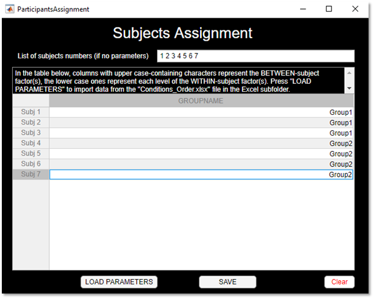

# RESTINGLAB

RESTINGLAB is an open-source [EEGLAB](https://github.com/sccn/eeglab)-based standalone software for automated/semi-automated Resting-State EEG data pre-processing and analyses.


*Currently the software is in beta version which means it may still contains errors.*\
*Contributions are thus more than welcome*.

**OF NOTE: This software can currently only import [BioSemi](https://biosemi.com/) 64-channels EEG files.**

*Throughout the Guided User Interfaces (GUIs) you will find additional information while pressing on the `❓` buttons.*


## Table of Contents


## Getting Started

When on the [RESTINGLAB startup page](https://github.com/CorentinWicht/RESTINGLAB), start by clicking on `⬇️ Code` on the top right of the screen and then `Download ZIP` to download the whole repository (alternatively you can also clone it). 

To run the GUI, double click the **`MainGUI.mlapp`** file that you will find in the repository.

The main page of the GUI will open up:


**At this stage, all the buttons are `RED 🔘`, meaning that no parameters have been yet defined and the script cannot run.**


Hence, first, you should decide whether:
```
* You want to run the Preprocessing phase only, the Analysis phase only or both of them (bottom switch)
* You want to define new parameters or want to load existing ones (LOAD PARAMETERS button)
```

Then, you should proceed sequentially by following the sequence of buttons (see below for detailed explanations):
```
1.Design ➡️ 2.Parameters ➡️ 3.Preprocessing ➡️ 4.Analyses ➡️ START
```


### 1.Design

Start by defining your experimental design, i.e. within- and/or between-subjects factor(s) and respective levels in the corresponding fields.\
The software can accomodate up to 1 within- and 1 between-subjects factors each including 3 levels.\
**Be careful as NO SPACES are allowed in the names**.

#### Within-subject factor (WS)
**The names chosen for each WS factor level should perfectly match the common names of your files.**\
*For example, if your files contain the patterns "**_awake**.bdf" & "**_asleep**.bdf", you should define the levels correspondingly: "**awake**" & "**asleep**".*

#### Between-subject factor (BS)
**Similarly, for the BS factor you should name each level respectively to the folders in which you stored their files.**\
*For example, if you stored your EEG data separately in two folders `Experimental` & `Placebo`, you should define the levels correspondingly: "**Experimental**" & "**Placebo**".*


Once you are satisfied with your design, press the **`DIRECTORY`** button.\
A number of windows will pop-up in order for you to define the path of each BS factor level's folder.\
**!Have a look at the title of each pop-up window to know which level you need to indicate a path for!** 


Once done, you will see a last pop-up window asking you where you want to save **all the files that will be exported**.


Then, press the `ALLOCATION` button to start defining which file belongs to what WS and/or BS levels.\
In the top field you have the possibility to define the subjects' number that you want to include (each number should be separated by a space).\
**DO NOT leave any empty line in the table as the software may crash.**

You can also load existing parameters (`LOAD PARAMETERS` button, i.e. look for the `Conditions_order.xlsx` file).

When you are happy with your choice, press `SAVE`.\
By doing so, the `Conditions_order.xlsx` file will generate in the folder your exports folder.




Now, you can press the `SUBJECTS` button which will allow you to select files to include and/or exclude.\ 
*Since this GUI is redundant with the previous the `ALLOCATION GUI`, it might be deleted in future releases.*\
Again, press the `SAVE` button when you are satisfied with your selection.


Finally, you can press the `SAVE` button when you are back to the `Design GUI` to switch to the next section.


### 2.Parameters

In the second GUI you have to define a few EEG data related parameters such as the extension (currently restricted to .bdf), sampling rate, channels, etc.\
**Importantly, in the top left field you should indicate a name that is common to all your files (e.g. "*Subj*").**\
This is important especially to avoid loading unrelated .bdf files that might be stored in your subfolders.\
*You can try to leave the field empty, but the software may crash*


Press the press the `SAVE` button to switch to the next section.


### 3.Preprocessing

The third GUI provides the user with the possibility to activate/deactivate specific algorithms (e.g. sleep detection (**currently not working**), ICA, ASR, etc.)\
Once you activate one of the algorithm (i.e. switch to `YES`), you can access their respective `Optional Parameters`below which are already filled with defaults.\
On the right side, you can activate the computation of Global Power Spectra and define which frequencies would you like to generate topographical plots (i.e. topoplots) for each file.\
If the `GPS swich` is on, you will be able to define the frequency bands of interest in the table below. Use the `ADD LINE` and `REMOVE LINE` button to adjust the table.


Finally, you can also define clusters of electrodes to compute the GPS (i.e. `2. GPS on Scalp Areas`), which will generate the following pop-up window:\
The first line enables to define the name of each cluster (separated by a space), while in each line you need to indicate the number or name of channels included in each cluster.


Press the press the `SAVE` button to switch to the next section.


### 4.Analyses

This last GUI enables you to run group and/or condition-wise statistical analyses.\
*This part is still under construction hence only few features are currently available.*

You have the possibility to redefine at this stage which files should be included in the analysis part by switching the `Subjects switch` to *Subset*.\
This will generate another GUI enabling you to include/exclude the files. 

On the right side, you can define whether to perform:
```
1.Frequency bands-level analyses (default is YES)
2. MicroStates analyses (default is NO)
3.Independent Components (IC) clustering and source localization (default is NO)
```
**OF NOTE, the `MicroStates analysis` is running but needs additionnal testing and the `IC clustering analysis` is currently NOT WORKING**\

Both the MicroStates and the IC Clustering analyses have respective setting that can be accessed by clicking on the `Settings button`.


Press the press the `SAVE` button to go back to the main GUI.

As soon as all the buttons have turned to `GREEN 🔘`, you can run the script by clicking on the `START button`.


## Dependencies
| PLUGINS | Description |
| ------ | ------ |
| [EEGLAB v14.1.2b](https://github.com/sccn/eeglab) | Importing the .set EEG files | 
| [FMUT v0.5.1](https://github.com/ericcfields/FMUT) | Computation of permutation-based statistics |
| [ept_TFCE](https://github.com/Mensen/ept_TFCE-matlab) | Computation of permutation-based statistics and TFCE correction |
| [Automatic Human Sleep Stage Scoring Using Deep Neural Networks](https://github.com/alexander-malafeev/feature-based-sleep-scoring) | Algorithm to classify sleep stages |
| [LBPA40 atlas v2011-04-28](https://resource.loni.usc.edu/resources/atlases-downloads/) | The LONI LBPA40 atlas is a high-quality probabilistic atlas |
| [CubeHelix v2.0](https://github.com/DrosteEffect/CubeHelix) | Color scheme generator |
| [mColonFolder v1.6.0](https://ch.mathworks.com/matlabcentral/fileexchange/29854-multiple-colon) | Enables concatenation of multiple colon-intervals |
| [Gramm](https://github.com/piermorel/gramm) | Gramm is a powerful plotting toolbox which allows to quickly create complex, publication-quality figures in Matlab, and is inspired by R's ggplot2 library |
| [PrepPipeline v0.55.3](http://vislab.github.io/EEG-Clean-Tools/) | The PREP pipeline is a standardized early-stage EEG processing pipeline that focuses on the identification of bad channels and the calculation of a robust average reference |


| EEGLAB EXTENSIONS | Description |
| ------ | ------ |
| [AMICA v1.5](https://github.com/japalmer29/amica) | The Adaptive Mixture Independent Component Analysis (AMICA) toolbox provides the best IC decomposition | 
| [MPT v1.661](https://sccn.ucsd.edu/wiki/MPT) |  Probabilistic approach to EEG source comparison and multi-subject inference | 
| [BLINKER v1.1.2](http://vislab.github.io/EEG-Blinks/) | BLINKER  is an automated pipeline for detecting eye blinks in EEG and calculating various properties of these blinks | 
| [ASR v2.0](https://github.com/sccn/clean_rawdata) | ASR (automated subspace removal) detects and rejects or removes high-amplitude non-brain ('artifact') activity (produced by eye blinks, muscle activity, sensor motion, etc.) by comparing its structure to that of known artifact-free reference data | 
| [CleanLine v1.04](https://github.com/sccn/cleanline) | This plugin adaptively estimates and removes sinusoidal (e.g. line) noise from your ICA components or scalp channels using multi-tapering and a Thompson F-statistic | 
| [EEGBrowser v1.0 ](https://github.com/aojeda/EEGBrowser) | Enhanced visualization for continuous EEG recordings | 
| [fitTwoDipoles v0.01](https://link.springer.com/chapter/10.1007%2F978-3-319-32703-7_22) | Routine for automated recommendation of ICs that may be best fit with a position-symmetric dual-dipole model | 
| [ICLabel v1.2.4](https://sccn.ucsd.edu/wiki/ICLabel) | Automatic independent component (IC) classifcation based on the ICLabel project's classifier | 
| [MST v1.0](https://github.com/atpoulsen/Microstate-EEGlab-toolbox) | Tee toolbox includes ability to run microstate analysis on both ERP and spontaneous (e.g. resting state) EEG | 
| [Viewprops v1.5.4](https://sccn.ucsd.edu/wiki/Viewprops) | Enhanced visualization of independent components (ICA) | 


Isolated functions:
* [Timerwaitbar v1.02](https://ch.mathworks.com/matlabcentral/fileexchange/55985-timer-waitbar) (upgraded)
* [bluewhitered v1.00](https://ch.mathworks.com/matlabcentral/fileexchange/4058-bluewhitered)
* [limo_FDR from the LIMO Toolbox](https://github.com/LIMO-EEG-Toolbox/limo_tools)
* [natsort v2.10](https://ch.mathworks.com/matlabcentral/fileexchange/47434-natural-order-filename-sort)
* [saveeph](https://sites.google.com/site/cartoolcommunity/files)
* [textprogressbar v1.00](https://ch.mathworks.com/matlabcentral/fileexchange/28067-text-progress-bar)
* [topoplotIndie](https://www.mikexcohen.com/)
* [vis_artifacts](https://github.com/sccn/clean_rawdata/blob/master/vis_artifacts.m)
* [hline v1.00 & vline v1.00](https://ch.mathworks.com/matlabcentral/fileexchange/1039-hline-and-vline)
* [Composite Colormap v1.00](https://ch.mathworks.com/matlabcentral/fileexchange/59994-composite-colormap?focused=6997081&tab=function)
* [ShadedErrorBar v3.00](https://ch.mathworks.com/matlabcentral/fileexchange/26311-raacampbell-shadederrorbar)
* [getdrives v1.3.0.1](https://ch.mathworks.com/matlabcentral/fileexchange/1082-getdrives)
* [RemoveSheet123 v1.0](https://ch.mathworks.com/matlabcentral/fileexchange/50371-removesheet123-remove-default-excel-sheets)
* [sort_nat v1.4](https://ch.mathworks.com/matlabcentral/fileexchange/10959-sort_nat-natural-order-sort)
* [xlsColNum2Str v1.4](https://ch.mathworks.com/matlabcentral/fileexchange/15748-excel-column-number-to-column-name)


The dependencies are already included in the [functions/Dependencies](functions/Dependencies) folder.

## Authors
[**Corentin Wicht**](https://www.researchgate.net/profile/Wicht_Corentin)\
*SNSF Doc.CH PhD student*\
*corentin.wicht@unifr.ch, corentinw.lcns@gmail.com*\
*[Laboratory for Neurorehabilitation Science](https://www3.unifr.ch/med/spierer/en/)*\
*University of Fribourg, Switzerland*

[**Christian Mancini**](https://www.researchgate.net/profile/Christian_Mancini)\
*Research assistant*\
*christian.mancini@unifr.ch*\
*[Laboratory for Cognitive and Neurological Sciences](https://www3.unifr.ch/med/annoni/en/)*\
*University of Fribourg, Switzerland*

## License
<a rel="license" href="http://creativecommons.org/licenses/by-nc/4.0/"></a><br />This work is licensed under a <a rel="license" href="http://creativecommons.org/licenses/by-nc/4.0/">Creative Commons Attribution-NonCommercial 4.0 International License</a>.

See the [LICENSE.md](LICENSE.md) file for details

## Acknowledgements
[Dr. med. Joelle Chabwine](https://www.researchgate.net/profile/Joelle_Chabwine), [PD Dr. Lucas Spierer](https://www.researchgate.net/profile/Lucas_Spierer) and [Prof. Jean-Marie Annoni](https://www.researchgate.net/profile/Jean-Marie_Annoni) from the University of Fribourg and the Fribourg County Hospital provided substantial support and advices regarding theoretical conceptualization as well as access to the workplace and the infrastructure required to successfully complete the project. Additionally, [Hugo Najberg](https://github.com/HugoNjb) and [Dr. Michael Mouthon](https://www3.unifr.ch/med/fr/section/personnel/all/people/3229/6a825) provided valuable advices regarding programming issues in MATLAB and technical support.

## Fundings
This research was supported by [Swiss National Science Foundation](http://www.snf.ch/fr/Pages/default.aspx) grants:
* [#P0LAP1_181689](http://p3.snf.ch/project-181689) to Corentin Wicht
* [#320030_175469](http://p3.snf.ch/project-175469) to PD Dr. Lucas Spierer
* **JOELLE + JMA ???**
